# Modelo 3D

- Aproximação de uma superfície por malha triangular
- Representação prática e comum para modelos 3D em CG

# Modelo 3D - Toro

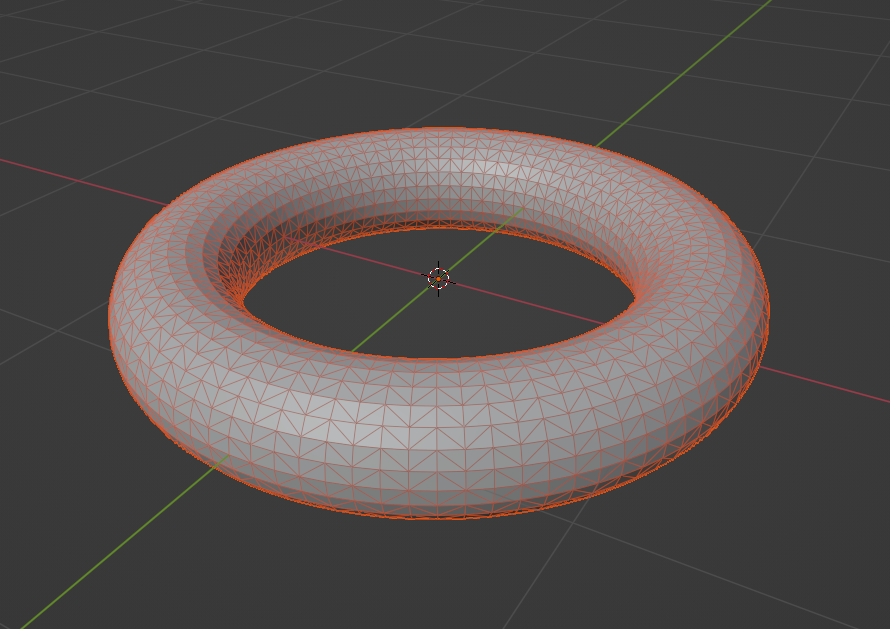

# Modelo 3D - Suzanne

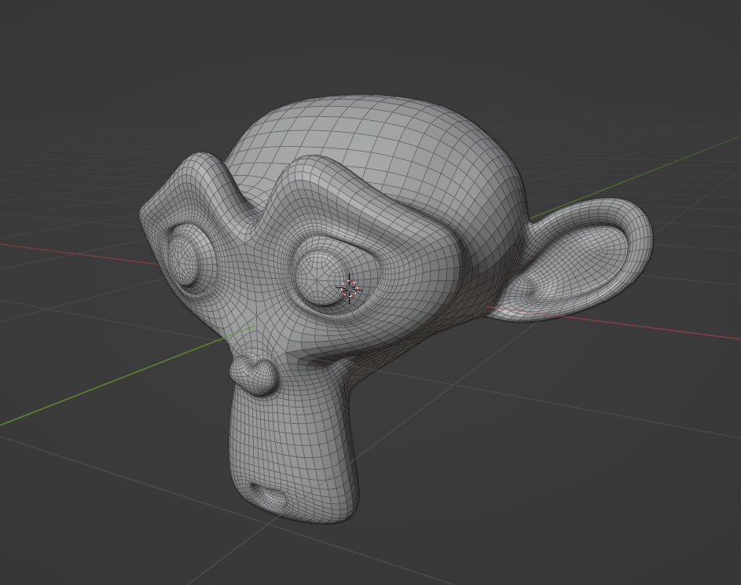

# O que quero?

- Calcular parâmetros da geometria intrínseca da superfície representada pelo modelo
  - Curvatura Gaussiana
  - Curvatura Normal
  - Primeira Forma Fundamental
  
# Ideia inicial - vetores normais

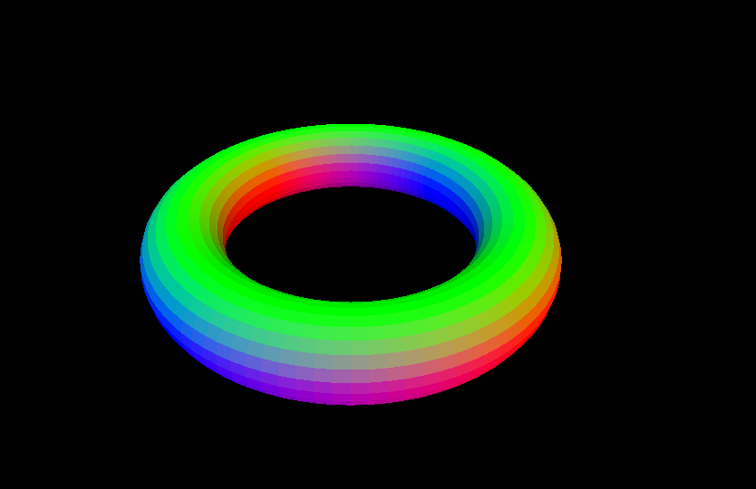

# Ideia inicial - vetores normais

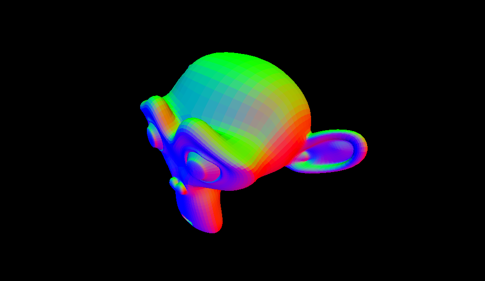

# Ideia inicial - GLSL

```glsl
in vec3 out_position;
in vec3 out_normal;

out vec4 frag_color;

void main() {
    frag_color = vec4(out_normal, 1.0);
}
```

# {.plain}

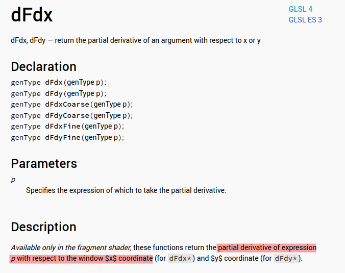

# Ideia inicial - GLSL

``` glsl
void main() {
    vec3 u = abs(dFdxFine(out_normal));
    vec3 v = abs(dFdyFine(out_normal));

    float lu = length(u);
    float lv = length(v);

    frag_color = vec4(lu, lv, 0.0, 1.0);
}
```

# Ideia inicial - GLSL

Inicialmente deu tela preta.....

# Ideia inicial - GLSL

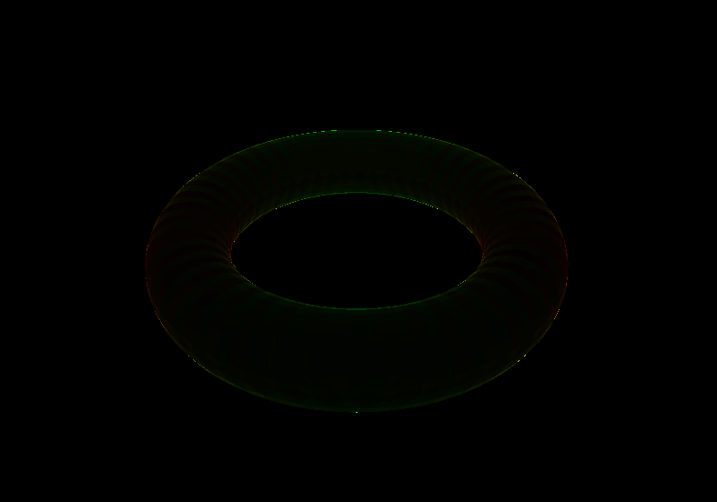

# Segunda ideia - aproximação

- Inspirado em (1)
- Se sabemos a cara da parametrização, fica fácil...

# Ideia - ajustar um paraboloide

$$f(u,v) = \frac{1}{2}\left( au^2 + 2buv + cv^2 \right)$$

# Ideia - ajustar um paraboloide

Se eu descobrir $a, b, c$, tenho...

\begin{equation}
    S = - \begin{pmatrix}
        a & b \\
        b & c
    \end{pmatrix}
\end{equation}

\begin{equation}
    K = \operatorname{det} S
\end{equation}

\begin{equation}
    H = \operatorname{tr} S
\end{equation}

# Como?

- Para cada vértice $p$
- Descobre base de $T_pS$ e completa pra base de $\mathbb{R}^3$ com a normal
- Encontra coordenadas de cada vértice vizinho nessa base
- Pro vizinho $p_i$, se $p_i = u_i e_1 + v_i e_2 + n_i N$, coloca $f(u_i, v_i) = n_i$
- Resolve por Quadrados Mínimos!

# Como?

\begin{gather*}
    U = \begin{pmatrix}
        \frac{u_1^2}{2} & u_1 v_1 & \frac{v_1^2}{2} \\
        \frac{u_2^2}{2} & u_2 v_2 & \frac{v_2^2}{2} \\
        \frac{u_3^2}{2} & u_3 v_3 & \frac{v_3^2}{2} \\
    \end{pmatrix} \\
    X = \begin{pmatrix}
        a \\
        b \\
        c \\
    \end{pmatrix} \\
    F = \begin{pmatrix}
        n_1 \\
        n_2 \\
        n_3 \\
    \end{pmatrix}
\end{gather*}

# Como?

$$UX = F$$

$$X = U^{-1} F$$

# Antes disso

Como encontrar cada $T_pS$?

- Encontrar vizinhanças
- Calcular normais médias
- Para cada ponto $p$
  - Escolher um vetor qualquer $a'$ que não seja paralelo ao $T_pS$
  - Projetar $a'$ em $T_pS$ e normalizar a projeção para conseguir $a$
  - $b = \frac{a \times N}{|a \times N|}$
  - $\{a, b\}$ é base de $T_pS$
  - Monta matriz mudança de base da canônica para $\{ a, b, N \}$

# Depois...

- Para cada ponto $p$, escolhe os vizinhos $p_1, p_2, p_3$
- Encontra as coordenadas na base $\{a, b, N\}$
- Completa as matrizes
- Faz contas
- ????
- Profit

# {.plain}

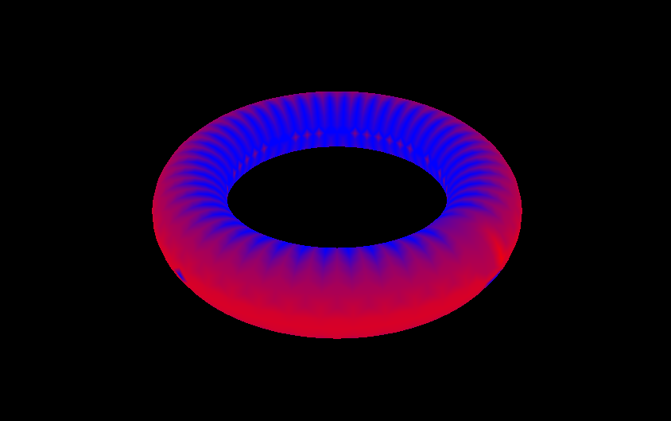

# {.plain}

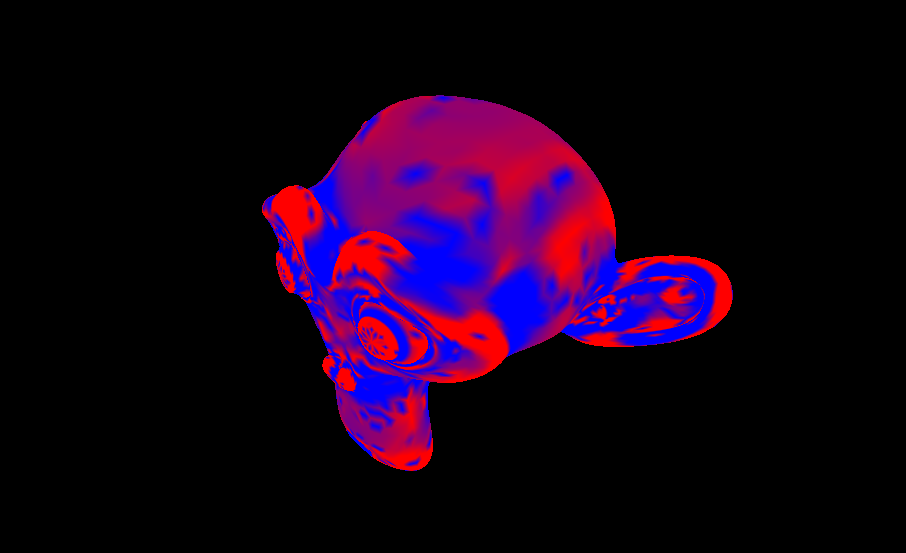

# {.plain}

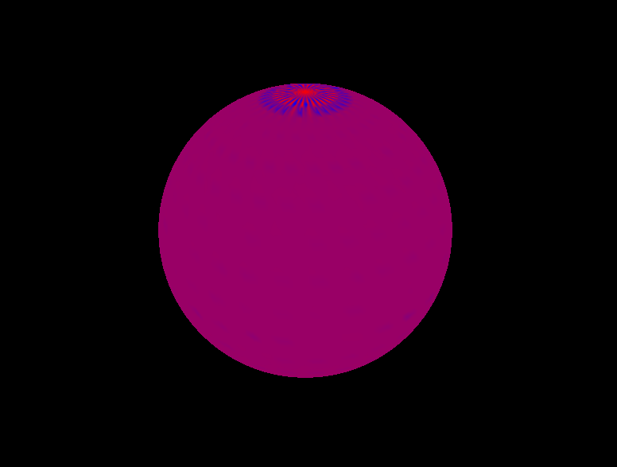

# {.plain}

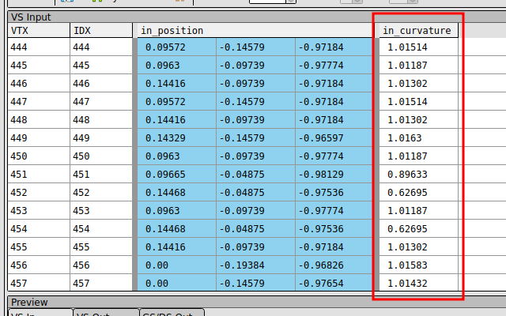

# {.plain}

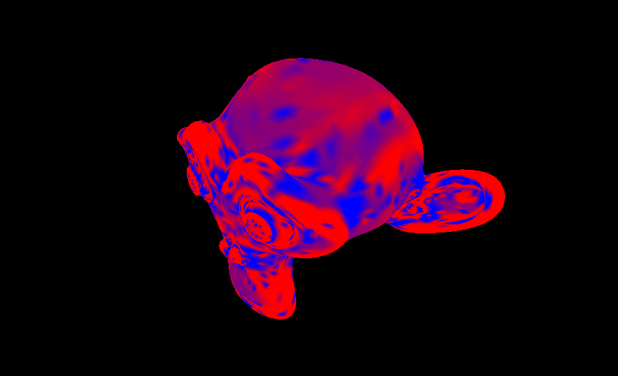

# Documentação live!

[https://edurenesto.github.io/ufabc-gd2-gauss/gauss/geom/index.html](https://edurenesto.github.io/ufabc-gd2-gauss/gauss/geom/index.html)

# Open source

[https://github.com/EduRenesto/ufabc-gd2-gauss](https://github.com/EduRenesto/ufabc-gd2-gauss)

# Referências

[1] Bærentzen, J.A., Gravesen, J., Anton, F., Aanæs, H. (2012).
  Curvature in Triangle Meshes. In: Guide to Computational Geometry Processing.
  Springer, London. https://doi.org/10.1007/978-1-4471-4075-7_8
